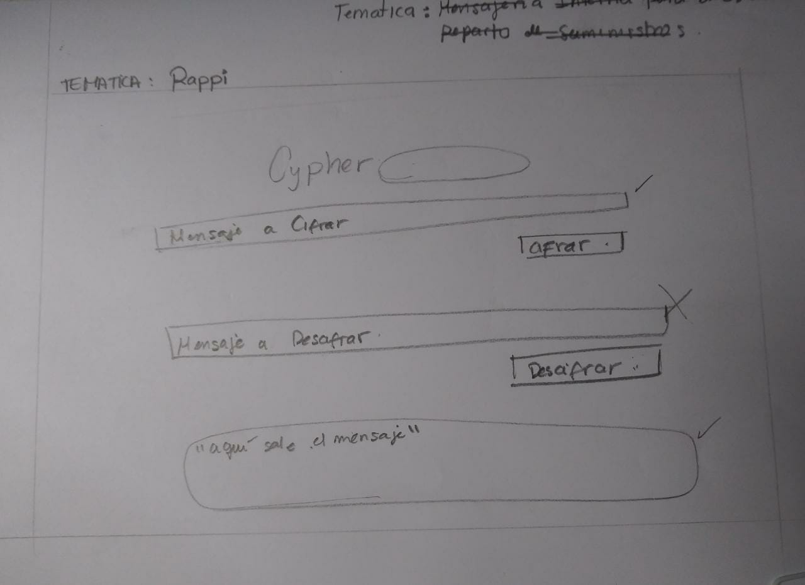
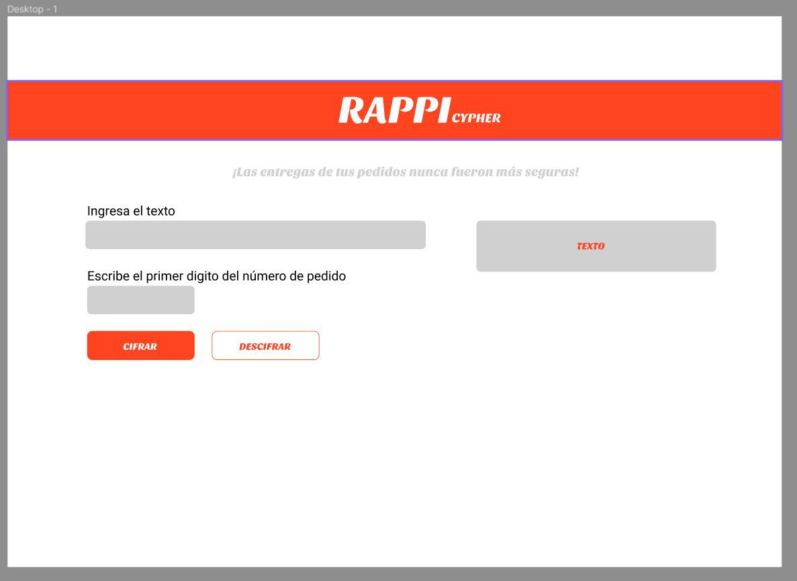
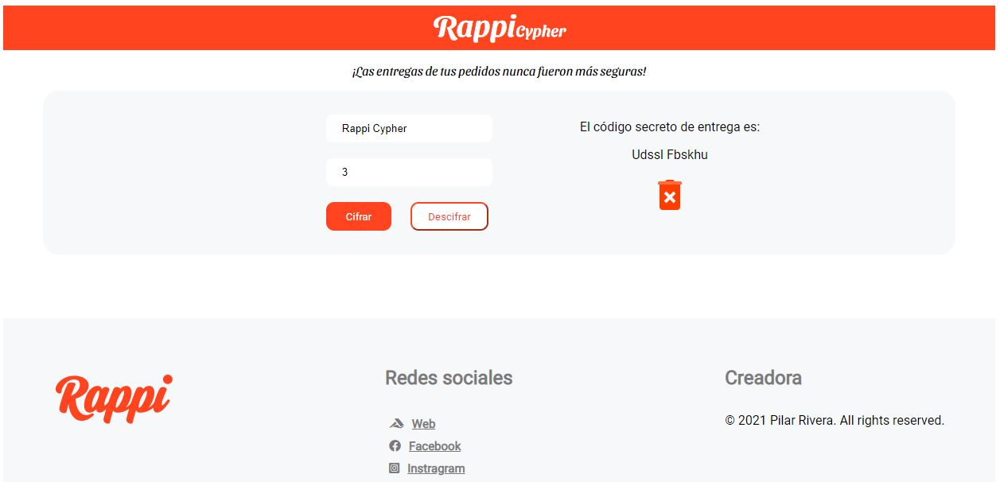

# RappiCypher

## Índice

* [1. Resumen del proyecto](#1-resumen-del-proyecto)
* [2. Definición del producto](#2-definicion-del-producto)
* [3. Características del proyecto](#3-caracteristicas-del-proyecto)
* [4. Funcionalidad](#4-funcionalidad)
* [5. Prototipo](#5-prototipo)
* [6. Decisiones de diseño](#6-decisiones-de-diseño)
* [7. Interfaz de usuario](#7-interfaz-de-usuario)

***

## 1. Resumen del proyecto

RappiCypher es un aplicativo web inspirado en la empresa Rappi y su proceso de entrega de pedidos, este genera códigos secretos de entrega mediante métodos de cifrado y descifrado. El cual afianza que el proceso de entrega a los clientes sean precisos y no exista margen de error.

## 2. Definición del producto

### ¿Quiénes son los principales usuarios de producto?
Esta aplicación web está dirigida a los clientes de la marca Rappi que deseen tener mayor seguridad en las entregas de sus pedidos.

### ¿Cuáles son los objetivos de estos usuarios en relación con tu producto?
Cifrar o descifrar el código de seguridad de la entrega, esto permite acceder a una clave secreta a los clientes a la hora de la entrega de sus pedidos.

### ¿Cómo crees que el producto que estás creando está resolviendo sus problemas?
Esta aplicación se inspiró en la logística del proceso de entrega de la empresa Rappi. Al ver que un porcentaje significativo de clientes reportaba haber recibido un pedido equivocado o definitivamente no haberlo recibido. Se pudo realizar encuestas a los clientes el cual ayudo a identificar el problema. Los pedidos estaban siendo entregados a personas equivocadas, debido a que los repartidores no verificaban con precisión quien era el verdadero cliente. RappiCypher cifrar y descifrar un código de entrega secreto el cual permitirá solucionar el problema de verificación del cliente por parte de los repartidores.

## 3. Características del proyecto

El proyecto utiliza el método de cifrado César, es un tipo de cifrado por sustitución, es decir que cada letra del texto original es reemplazada por otra que se encuentra un número fijo de posiciones (desplazamiento) más adelante en el mismo alfabeto. Acepta las letras mayúsculas y minúsculas, así como los espacios que van entre ellas.

## 4. Funcionalidad

Para su correcto funcionamiento esta aplicación web requiere de los siguientes datos:
1. Texto que se desee cifrar o descifrar
2. Número (offset) el cual permite el desplazamiento de los caracteres

Al ingresar estos datos en los campos indicados la aplicación procederá a cifrar o descifrar el código de entrega secreto.

## 5. Prototipo

*Prototipo 1
El prototipo inicialmente fue diseñado a mano

*Prototipo 2
##El segundo prototipo fue diseñado con la herramienta Figma

## 6. Decisiones de diseño

- Se utilizo el logo de la empresa y sus colores insignia. 
- Se inserto un pie de página donde se muestran las redes sociales de la empresa.
- Se opto por implementar una interfaz fácil de usar, presentando un diseño amigable y sencillo.

## 7. Interfaz de usuario

La interfaz del usuario permite cifrar y descifrar texto mediante un desplazamiento (offset) aplicando el cifrado César, al insertar el texto podemos ver el resultado del cifrado y descifrado. También, contamos con un botón que permite borrar los datos ingresados para poder cifrar o descifrar más textos. Por último podemos apreciar la sección del pie de página donde se encuentra el logo y las redes sociales de la empresa.

